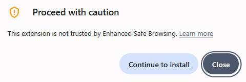
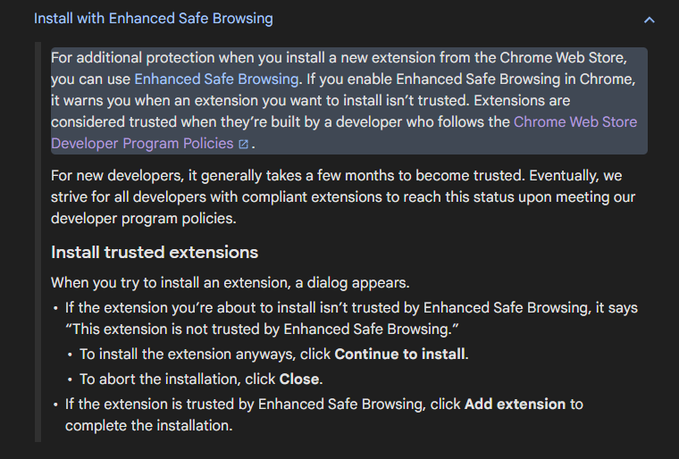

# AutoplayStopper (MV3)

This extension is compatible with all Chromium based browsers such as: Brave, Chrome, Edge, Opera, Vivaldi, etc.

Some browsers such as such as [Brave](https://brave.com) or [Vivaldi](https://vivaldi.com), or even [Firefox](https://www.firefox.com) already have proper browser based autoplay blocking support. Just enable the browser's built-in autoplay blocking feature in the settings.

## Description

Blocks video and audio autoplay across websites. Can be turned ON/OFF from the browser toolbar.

It is inspired by the original [AutoplayStopper](https://chromewebstore.google.com/detail/AutoplayStopper/ejddcgojdblidajhngkogefpkknnebdh) Chrome Extension. ([Repository of the original extension](https://github.com/kenijo/AutoplayStopperMV2))

## Release Notes

Version 2025.08.19

- Provide much stricter blocking of autoplay across all websites (including msn.com and others)

Version 2025.08.18 (2.0)

- Rewrite extension to be stricter and cover a wider range of websites

- Add the ability to turn the extension ON/OFF from the toolbar

Version 2025.08.04 (1.1)

- Initial release

## Enhanced Safe Browsing

If you have Enhanced Safe Browsing enabled, you may see the following error message:

